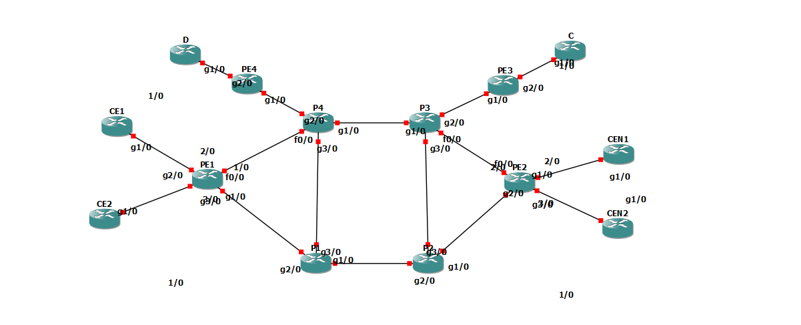

# README - Projet 3TCA NAS

## Contributeurs

Amet Aly Toure (amet.toure@insa-lyon.fr)
Mikaîl Ounissi (mikail.ounissi@insa-lyon.fr )
Nathan Lehodey (nathan.lehodey@insa-lyon.fr)
Nicolas Leportier (nicolas.lepotier@insa-lyon.fr)
Mahamat Tahir Saleh (tahir.mahamat-saleh@insa-lyon.fr)
Alaaeddine Ahriz (alaaeddine.ahriz@insa-lyon.fr)

## Objectif

L'objectif de ce projet est d'automatiser le provisionnement des services VPN BGP/MPLS sur un réseau utilisant le logiciel GNS3. Plus précisément, nous cherchons à ajouter des fonctionnalités MPLS et BGP/MPLS VPN à un projet GNS existant.
Pour cela, on définit un fichier .json d'intention, où on décrit la topologie de notre réseau avec les services au niveau de chaque interface.
Ensuite un code python lit ce fichier intention et produit en conséquence un fichier de configuration pour chaque routeur. Et finalement, un autre code python lit ces fichiers de configuration pour lancer, avec l'aide de telnet, les configurations au niveau des routeurs sur GNS3.

## Architecture du réseau

## Guide de démarrage rapide
### Configuration GN3
En faisant un pull du projet, vous aurez en local entre autres le fichier GNS3 **fin.gns3** et le répertoire qui contient les configs
des routeurs **project-files**.

Il suffit juste (en ayant GNS3 bien configuré sur votre machine en local avec la bonne image de routeur), de lancer le fichier **fin.gnS3**.d

### Génération de Configuration avec python depuis le fichier d'intention

Utiliser le script Python **generate_config_files.py** pour générer les fichiers de configuration pour chaque routeur.
Les fichiers de configuration seront sauvegardés dans le répertoire dev/config_files.

### Déploiement des Configurations avec telnet

Utiliser le script Python **telnet_deployment.py** pour déployer les configurations sur chaque routeur.
Ce script se connectera à chaque routeur via Telnet et enverra les commandes de configuration.
Le script nécessite les port sur lesquels sont connectés les routeurs en local: 
    - il faut donc consulter les numéros de port des routeur au niveau de l'UI de GNS3 (à gauche souvent): penser à bien démarrer tous les routeurs!
    - ensuite dans le code source **deploy_telnet.py**, faut renseigner les ports pour les routeurs correspondant dans le dictionnaire **routers_gns3**: par exemple routers_gns3 = {
                                                        "PE1": "5002",
                                                        "PE2": "5006",
                                                        "P1": "5014",
                                                        ...
                                                        }

# Description du réseau MPLS VPN
Voici une brève description de la configuration d'un réseau MPLS VPN comprenant 14 routeurs, avec des fonctionnalités spécifiques pour différents clients et des points d'accès multiples.

## Caractéristiques du réseau :
Nombre de routeurs : 14 dont 6 clients, 4 PE et 4 P dont 2 RR.

Protocoles : OSPF et MPLS sont mis en place dans le backbone. IBGP est utilisé entre les PE et les RR. EBGP et VPN utilisé entre les PE et les clients.

Clients :
Le réseau prend en charge quatre clients différents, identifiés comme C, D, CE1, et CE2.

## Connexions interne client :
CE1 : CE1 est connecté à CEN1.

CE2 : CE2 est connecté à CEN2.

## Communication entre clients :
C et D : C et D peuvent communiquer entre eux.

C et CEN1/CEN2 : C peut communiquer avec CEN1 et CEN2.

D et CE1/CE2 : D peut communiquer avec CE1 et CE2.

## Fonctionnalités supplémentaires :

Route reflector : Les routeurs P3 et P4 agissent en tant que route reflectors et sont configurés pour une communication en full mesh avec tous les routeurs PE du réseau. Cela permet de transmettre efficacement les routes VPN à travers le réseau.

## Notes Supplémentaires

- L'automatisation de la configuration et du déploiement est cruciale pour ce projet. Les scripts Python fournis facilitent grandement ce processus.
- Assurez-vous de suivre les phases du projet dans l'ordre indiqué pour une progression logique et méthodique.
- Pour des détails spécifiques sur la configuration des routeurs et des protocoles, référez-vous aux ressources Cisco IOS et aux documents de référence mentionnés dans le projet.
